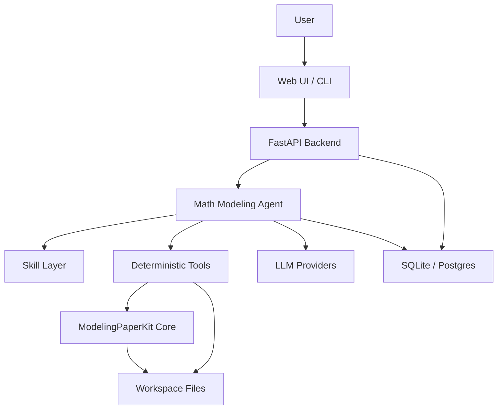
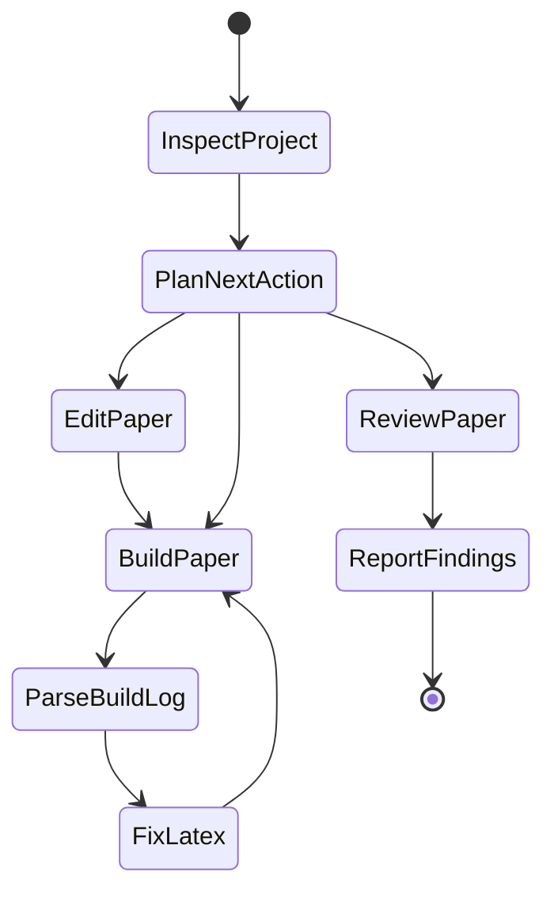

# ModelingPaperKit 升级架构蓝图

日期：2026-06-09

本文是在 [数学建模 Skill 市场调研报告](math-modeling-skill-market-report.md)、[真实数学建模比赛工作流调研](real-competition-workflow-research.md)、[ModelingPaperKit Skill 建设计划](modeling-paperkit-skill-plan.md) 和 [ModelingPaperKit Frontend Plan](modeling-paperkit-frontend-plan.md) 的基础上，进一步明确 `ModelingPaperKit` 从 LaTeX 模板仓库升级为 **Skill + Agent + 全栈应用** 的架构方案。

## 1. 总体判断

`ModelingPaperKit` 当前最有价值的基础不是智能体平台，而是：

- 数学建模竞赛论文模板。
- 可复用 LaTeX 核心宏包。
- 多赛事编译脚本。
- 示例论文与文档。

因此升级路线不应直接跳到“大型 Agent 平台”，而应分三层建设：

```text
第一层：PaperKit Core
LaTeX 模板、构建脚本、检查脚本、文档。

第二层：Skill Layer
把仓库知识、赛事规则、论文写作流程、LaTeX 约定封装成可复用 skill。

第三层：Agent / Full-stack Layer
用 Agent 调度 skill 和脚本，用 Web/CLI 给用户提供完整工作流。
```

核心原则：

```text
Skill 负责“怎么专业地做”。
Agent 负责“现在该做哪一步”。
全栈应用负责“让普通用户可见、可控、可恢复”。
```

## 2. 目标产品形态

长期产品可以叫：

```text
ModelingPaperKit Studio
```

它面向数学建模参赛队伍，提供从论文项目初始化到最终提交检查的工作台。

目标用户：

- 需要快速搭建国赛/美赛论文结构的参赛者。
- 已经有模型和结果，但需要组织成规范论文的团队。
- 会写 Python/LaTeX，但不想反复排查模板和编译问题的用户。
- 希望让 AI 辅助写作、排版、检查，但仍保留人工决策权的用户。

非目标：

- 纯自动代赛系统。
- 完整自动建模获奖系统。
- 泛学术论文写作平台。
- 大而全的数学模型百科。

## 3. 分层架构



### 3.1 PaperKit Core

职责：

- 提供 LaTeX 模板和核心宏包。
- 提供编译、清理、校验脚本。
- 提供示例论文和文档。

当前已有：

- `core/`
- `templates/`
- `scripts/build.py`
- `scripts/verify_build.py`
- `scripts/clean.py`
- `examples/`
- `docs/`

需要补齐：

- `scripts/summarize_build_log.py`
- `scripts/check_submission.py`
- `scripts/inspect_template.py`
- `scripts/check_tex_links.py`

### 3.2 Skill Layer

职责：

- 告诉 Agent 或 Codex 如何正确使用这个仓库。
- 用 references 记录赛事差异、LaTeX 约定、论文写作结构。
- 用 scripts 执行确定性检查。

建议目录：

```text
skills/modeling-paperkit/
├── SKILL.md
├── agents/
│   └── openai.yaml
├── references/
│   ├── workflow.md
│   ├── repository-map.md
│   ├── cumcm.md
│   ├── mcm.md
│   ├── wuyi.md
│   ├── beijing.md
│   ├── latex-patterns.md
│   ├── writing-patterns.md
│   ├── figure-table-style.md
│   └── final-review.md
├── scripts/
│   ├── summarize_build_log.py
│   ├── check_submission.py
│   ├── inspect_template.py
│   └── check_tex_links.py
└── assets/
    └── checklists/
```

### 3.3 Agent Layer

职责：

- 维护论文项目状态。
- 决定下一步调用哪个 skill 或脚本。
- 串联“初始化、写作、编译、排错、终审”流程。
- 把工具输出转成用户能理解的行动建议。

Agent 不应直接替代所有人类决策。它应该是有边界的工作流执行者：

- 可以建议章节结构。
- 可以修复 LaTeX 错误。
- 可以提示缺图、缺引用、疑似身份信息。
- 可以把用户已有结果组织成论文语言。
- 不应无依据编造实验结果。
- 不应承诺比赛成绩。
- 不应自动提交比赛文件。

### 3.4 Full-stack Layer

职责：

- 提供项目仪表盘。
- 展示章节状态、编译状态、检查清单。
- 提供对话式 Agent 控制。
- 让用户确认 Agent 的关键修改。
- 保存项目状态和历史记录。

它不是第一阶段必须品，但适合在 CLI Agent 稳定后开发。

## 4. 推荐技术栈

### 4.1 MVP CLI 技术栈

第一阶段建议只做 CLI Agent。

```text
Python 3.10+
Pydantic
Typer 或 argparse
SQLite
现有 scripts/build.py
现有 LaTeX 模板
OpenAI / Anthropic API 可插拔
```

原因：

- 和当前仓库已有 Python 脚本一致。
- 启动成本低。
- 容易测试。
- 不需要先解决 WebUI、部署、并发任务等复杂问题。

### 4.2 Agent 编排技术栈

推荐：

```text
LangGraph + Pydantic
```

LangGraph 适合状态机式 Agent，例如：

```text
inspect -> plan -> edit -> build -> parse_log -> fix -> review -> done
```

Pydantic 用于定义项目状态、检查结果、Agent 动作和 API payload。

### 4.3 后端技术栈

Web 版本建议：

```text
FastAPI
Pydantic
SQLite 起步，Postgres 后续
RQ 或 Celery
Docker Compose
```

选择理由：

- FastAPI 与 Python Agent/脚本天然兼容。
- Pydantic 可复用状态模型。
- SQLite 适合本地单用户 MVP。
- Postgres 适合多人团队和云部署。
- RQ/Celery 用于编译 LaTeX、跑检查、生成图表等后台任务。

### 4.4 前端技术栈

前端详细产品计划见：[ModelingPaperKit Frontend Plan](modeling-paperkit-frontend-plan.md)。

推荐：

```text
React
Vite
TypeScript
Tailwind CSS 或 CSS Modules
shadcn/ui 可选
Monaco Editor 可选
```

前端应偏工作台风格，而不是营销页：

- 左侧项目导航。
- 中间章节/文件编辑。
- 右侧 Agent 建议和检查结果。
- 顶部显示 build/review 状态。
- 下方或侧栏显示日志摘要。

### 4.5 LaTeX 与文件处理

继续复用现有工具：

```text
scripts/build.py
scripts/verify_build.py
scripts/clean.py
```

新增工具只做检查和摘要，不替代已有 build 流程。

## 5. Agent 架构

### 5.1 Agent 状态模型

建议维护 `.paperkit/state.json`：

```json
{
  "project_id": "demo-cumcm-c",
  "contest": "cumcm",
  "target": "cumcm",
  "problem_id": "C",
  "paper_title": "在此输入你的论文标题",
  "workspace": "templates/cumcm",
  "main_tex": "templates/cumcm/main_cumcm.tex",
  "sections": {
    "problem": "draft",
    "analysis": "draft",
    "assumptions": "missing",
    "notation": "draft",
    "model": "draft",
    "solution": "missing",
    "results": "missing",
    "validation": "missing",
    "evaluation": "missing",
    "conclusion": "missing"
  },
  "figures": [],
  "references": [],
  "last_build": {
    "status": "unknown",
    "pdf": null,
    "log": null,
    "errors": []
  },
  "last_review": {
    "status": "not_run",
    "critical": 0,
    "warnings": 0
  }
}
```

状态文件的价值：

- Agent 可以中断后恢复。
- UI 可以展示项目进度。
- 检查脚本有统一输入。
- 多次 build/review 有历史可追踪。

### 5.2 Agent 节点



节点职责：

| 节点 | 职责 |
|---|---|
| `InspectProject` | 识别模板、章节、图片、输出目录、状态文件 |
| `PlanNextAction` | 根据用户目标和项目状态选择下一步 |
| `EditPaper` | 修改 `main_*.tex` 或 `sections/*.tex` |
| `BuildPaper` | 调用 `scripts/build.py` |
| `ParseBuildLog` | 调用 `summarize_build_log.py` |
| `FixLatex` | 根据日志做最小必要修复 |
| `ReviewPaper` | 调用 `check_submission.py` 和 `check_tex_links.py` |
| `ReportFindings` | 输出分级问题和建议 |

### 5.3 Agent 工具接口

Agent 不应直接随意 shell。应封装工具：

```text
build_target(target, clean=False, bibtex=False)
summarize_log(target)
inspect_template(target)
check_submission(target)
check_tex_links(target)
read_section(target, section)
update_section(target, section, patch)
list_figures(target)
```

这样能控制权限和副作用。

### 5.4 Agent 模式

建议三种模式：

| 模式 | 用途 | 自动化程度 |
|---|---|---|
| Assist | 用户主导，Agent 给建议和局部修改 | 低 |
| Build-Fix | Agent 自动编译、读日志、修 LaTeX，再编译 | 中 |
| Final Review | Agent 只检查并报告，不主动改正文 | 中 |

不要在早期加入“Full Auto Paper”模式。

## 6. 全栈架构

### 6.1 后端模块

```text
backend/
├── app/
│   ├── main.py
│   ├── api/
│   │   ├── projects.py
│   │   ├── agent.py
│   │   ├── builds.py
│   │   ├── reviews.py
│   │   └── files.py
│   ├── agent/
│   │   ├── graph.py
│   │   ├── state.py
│   │   ├── tools.py
│   │   └── prompts.py
│   ├── services/
│   │   ├── build_service.py
│   │   ├── review_service.py
│   │   ├── workspace_service.py
│   │   └── skill_service.py
│   ├── models/
│   │   ├── project.py
│   │   ├── run.py
│   │   ├── review.py
│   │   └── file.py
│   └── db.py
└── pyproject.toml
```

### 6.2 前端模块

```text
frontend/
├── src/
│   ├── app/
│   ├── components/
│   │   ├── ProjectSidebar.tsx
│   │   ├── SectionEditor.tsx
│   │   ├── AgentPanel.tsx
│   │   ├── BuildStatus.tsx
│   │   ├── ReviewChecklist.tsx
│   │   └── LogSummary.tsx
│   ├── pages/
│   │   ├── Dashboard.tsx
│   │   ├── Project.tsx
│   │   ├── Build.tsx
│   │   └── Review.tsx
│   ├── api/
│   └── types/
└── package.json
```

### 6.3 数据库模型

MVP 可用 SQLite。

核心表：

| 表 | 用途 |
|---|---|
| `projects` | 论文项目 |
| `project_files` | 文件索引和编辑状态 |
| `agent_runs` | Agent 运行记录 |
| `build_runs` | 编译记录 |
| `review_runs` | 检查记录 |
| `findings` | 终稿检查问题 |
| `artifacts` | PDF、log、图片、报告 |

### 6.4 API 草案

```text
POST   /api/projects
GET    /api/projects
GET    /api/projects/{id}
GET    /api/projects/{id}/files
GET    /api/projects/{id}/files/{path}
PATCH  /api/projects/{id}/files/{path}

POST   /api/projects/{id}/build
GET    /api/projects/{id}/builds/{run_id}

POST   /api/projects/{id}/review
GET    /api/projects/{id}/reviews/{run_id}

POST   /api/projects/{id}/agent/run
GET    /api/projects/{id}/agent/runs/{run_id}
```

## 7. 用户工作流

### 7.1 初始化项目

```text
用户选择赛事 -> 选择题号 -> 创建项目 -> 复制模板 -> 初始化 state.json
```

CLI：

```bash
paperkit-agent init --target cumcm --problem C --title "..."
```

Web：

```text
New Project -> Contest -> Problem -> Template -> Create
```

### 7.2 写作组织

```text
Agent 检查章节 -> 给出缺口 -> 用户提供模型/结果 -> Agent 辅助写入 sections
```

重点：

- 不编造数据。
- 不编造实验结果。
- 可以帮用户把已有结果组织成论文表达。
- 可以提醒哪个章节缺少公式、图表、结果解释。

### 7.3 编译排错

```text
build.py -> log -> summarize_build_log.py -> Agent 最小修复 -> rebuild
```

这是最适合 Agent 自动化的高价值流程。

### 7.4 终稿检查

```text
check_submission.py -> check_tex_links.py -> final-review checklist -> 分级报告
```

输出分级：

- `Critical`：必须修复，否则可能无法编译或违规。
- `Warning`：建议修复，会影响论文质量。
- `Info`：提示项或可接受风险。

## 8. 真实有效且必要的功能

这些功能应优先进入开发队列。

### 8.1 编译与日志能力

必要性：极高。

原因：

- LaTeX 编译失败是最直接阻塞。
- 用户很难从 `.log` 中定位真正错误。
- 现有 `build.py` 已有基础，但摘要能力可以更强。

产物：

- `summarize_build_log.py`
- `Build-Fix` Agent 模式。
- Web 中的 `LogSummary` 组件。

### 8.2 提交前检查

必要性：极高。

原因：

- 数学建模提交事故常常不是模型问题，而是格式、匿名、缺页、缺图、引用等硬伤。
- 检查可以确定性执行，适合脚本化。

产物：

- `check_submission.py`
- `check_tex_links.py`
- `ReviewChecklist` 组件。

### 8.3 模板和章节状态识别

必要性：高。

原因：

- Agent 需要知道当前项目状态。
- UI 需要展示章节完成度。

产物：

- `inspect_template.py`
- `.paperkit/state.json`
- `ProjectSidebar` 章节状态。

### 8.4 Skill references

必要性：高。

原因：

- 这是让 Codex/Agent 贴合本仓库的核心。
- 能防止 Agent 使用不符合模板的 LaTeX 写法。

产物：

- `latex-patterns.md`
- `cumcm.md`
- `mcm.md`
- `final-review.md`

### 8.5 CLI Agent

必要性：中高。

原因：

- 在没有 WebUI 前，可以验证 Agent 工作流。
- 可以复用到后端服务。

产物：

- `paperkit-agent init`
- `paperkit-agent build`
- `paperkit-agent review`
- `paperkit-agent fix-log`

## 9. 暂缓功能

这些功能不应该进入第一阶段。

| 功能 | 暂缓原因 |
|---|---|
| 全自动完成比赛 | 风险高，不符合本仓库定位 |
| WebUI 首发 | 没有稳定 skill/scripts 时 UI 价值有限 |
| 多 Agent 协作 | 初期单 Agent 足够 |
| 大模型型自动评分 | 难以验证，容易误导用户 |
| RAG 模型库 | 资料维护成本高，先做 references |
| 自动联网查赛规 | 赛规高风险，应该由用户提供或人工确认 |
| 自动提交文件 | 涉及责任边界，不建议做 |

## 10. 开发阶段

### Phase 0：仓库检查能力

目标：补齐真实急缺的脚本。

产物：

- `scripts/summarize_build_log.py`
- `scripts/check_submission.py`
- `scripts/inspect_template.py`
- `scripts/check_tex_links.py`

验收：

- 能对 `cumcm`、`mcm`、`example` 至少做静态检查。
- 能解析常见 LaTeX 错误。
- 能输出 JSON 和人类可读文本两种格式。

### Phase 1：Skill 集成

目标：把仓库知识变成可复用 skill。

产物：

- `skills/modeling-paperkit/SKILL.md`
- `references/workflow.md`
- `references/repository-map.md`
- `references/latex-patterns.md`
- `references/cumcm.md`
- `references/mcm.md`
- `references/final-review.md`

验收：

- Codex 触发 skill 后，能正确选择模板、修改章节、运行检查。
- `SKILL.md` 精简，详细内容通过 references 渐进加载。

### Phase 2：CLI Agent

目标：验证 Agent 能否稳定调度 skill 和脚本。

产物：

- `paperkit-agent`
- `.paperkit/state.json`
- `.paperkit/state.schema.json`

验收：

- `init/build/review/fix-log` 四个命令可用。
- Agent 能从失败编译进入日志解析和最小修复。
- Agent 不做无依据内容生成。

### Phase 3：后端服务

目标：把 CLI Agent 能力封装成 API。

产物：

- FastAPI backend。
- 项目、文件、build、review、agent run API。
- SQLite 数据库。
- 后台任务队列。

验收：

- 能创建项目。
- 能触发编译。
- 能触发检查。
- 能查看 Agent 运行记录。

### Phase 4：Web 工作台

目标：给普通用户可视化工作流。

产物：

- Dashboard。
- Project editor。
- Agent panel。
- Build status。
- Review checklist。
- Log summary。

验收：

- 用户能在 Web 中创建项目、查看章节、运行 build/review。
- 用户能看到 Agent 建议并确认关键修改。

### Phase 5：产品化增强

目标：在真实使用后扩展能力。

候选：

- 多用户协作。
- GitHub Actions 编译验证。
- PDF 预览。
- 图表质量检查。
- 摘要专项评审。
- 数据/建模 skill 接入。

## 11. 目录演进建议

当前仓库可以先保持轻量，不急着引入完整 monorepo。

第一阶段：

```text
ModelingPaperKit/
├── core/
├── templates/
├── scripts/
├── docs/
└── skills/
    └── modeling-paperkit/
```

CLI Agent 阶段：

```text
ModelingPaperKit/
├── agent/
│   ├── cli.py
│   ├── state.py
│   ├── tools.py
│   └── graph.py
├── skills/
└── scripts/
```

全栈阶段：

```text
ModelingPaperKit/
├── backend/
├── frontend/
├── agent/
├── skills/
├── core/
├── templates/
├── scripts/
└── docs/
```

## 12. 验收标准

### Skill 层成功标准

- Codex 能识别当前目标赛事。
- Codex 能按本仓库宏包规范写 LaTeX。
- Codex 能正确调用 build 和检查脚本。
- Codex 能做提交前分级 review。

### Agent 层成功标准

- Agent 能维护项目状态。
- Agent 能执行固定流程。
- Agent 能从工具输出中决定下一步。
- Agent 修改文件前后能解释原因。
- Agent 不编造数据和实验结果。

### 全栈层成功标准

- 用户能在 UI 中看到项目状态。
- 用户能运行 build/review。
- 用户能查看日志摘要和检查结果。
- 用户能确认或拒绝 Agent 修改。
- 后台任务可恢复、可追踪。

## 13. 最小可行路线

如果只选最值得做的 6 件事：

1. `summarize_build_log.py`
2. `check_submission.py`
3. `inspect_template.py`
4. `latex-patterns.md`
5. `modeling-paperkit/SKILL.md`
6. `paperkit-agent build/review/fix-log`

这 6 件事会直接把仓库从“模板集合”升级成“可被 Agent 稳定调用的论文交付系统”。

## 14. 最终建议

建议路线：

```text
不要先做大型 Agent。
不要先做 WebUI。
不要先做全自动建模。

先做检查脚本。
再做 Skill。
再做 CLI Agent。
最后做全栈工作台。
```

Agent 和 Skill 是相辅相成的，但顺序很重要。Skill 和脚本是 Agent 的地基；没有地基，Agent 只会变成一个会说计划但缺少可靠执行能力的外壳。
